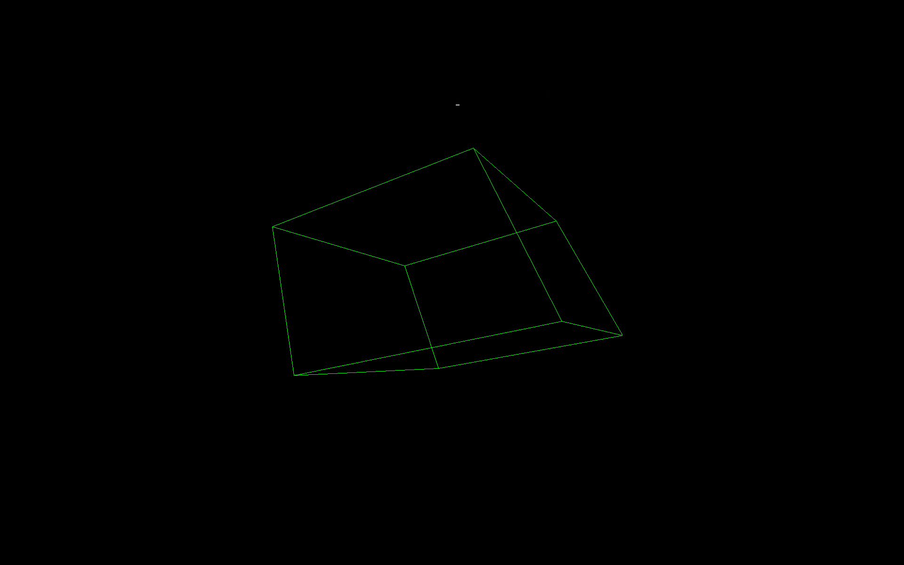
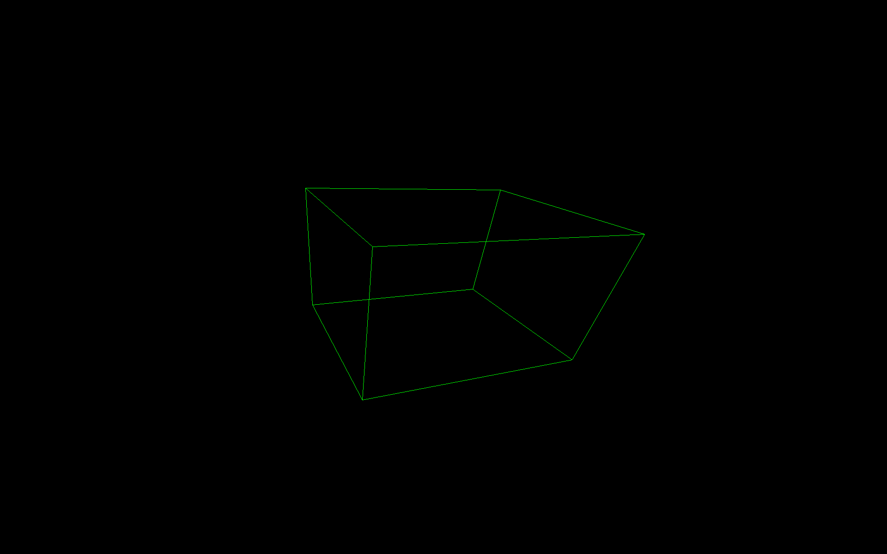

## OpenBL
Any similarities between the name of this project and the commonly known "OpenGL" are purely coincidental

This is a rendering program that I built on the Linux framebuffer. All it does is animate a rotating cube. My device doesn't actually even have that much support for fbdev, I can't even pan the display, I have to resort to storing a buffer in dynamic memory and just copying it over.

This was a cool project and I learnt a lot from it. Mainly used the wikipedia entry on rotation matrices, as well as  [Tsoding's video on 3d graphics](https://www.youtube.com/watch?v=qjWkNZ0SXfo)

Screenshots taken using [fbss](https://github.com/BryceNadj/fbss)

Also thanks CAB403 for the code used in `mesh.c`
